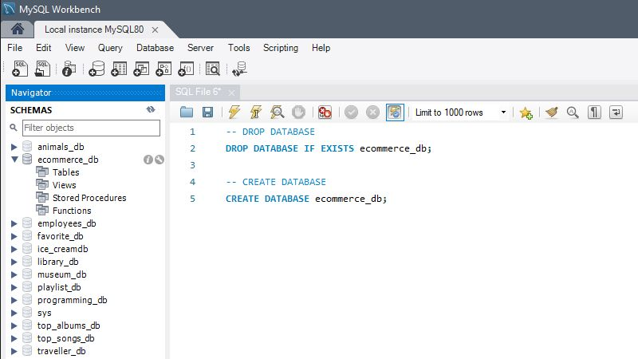
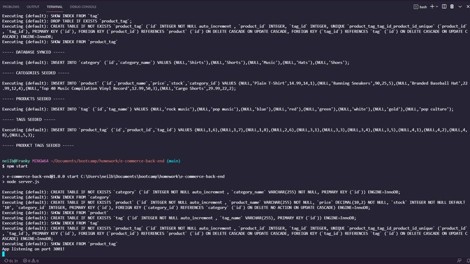
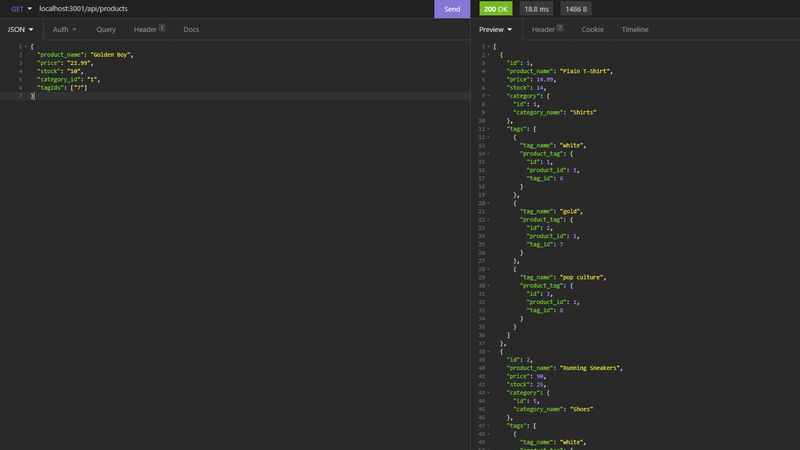

# E-Commerce Back End  

## Description  

This is a built-out back end for a mock e-commerce site. It is a complete database that spans multiple tables and is fully accessible and interactive via API clients and browsers. The routes and models are achieved here through the MySQL2, Sequelize, and Express Node.js packages.

## Table of Contents
- ### [Installation](#installation)
- ### [Usage](#usage)
- ### [Screenshots](#screenshots)
- ### [Contributing](#contributing)
- ### [Questions](#questions)
  

## Installation  

MySQL and a related CLI/GUI are needed (Workbench was used for development) along with Node.js. Use the provided schema to set up the database through MySQL, open the terminal, run 'npm install' from the root level of the project and then 'npm run seed' both on the command line.

## Usage  

Once the application is called by running 'npm start' in the terminal, the user can view the database information from a browser through the local host channel via the various API routes or access and interact with the database using their favorite API client software. Insomnia was used in this project for demonstration.  

Check out this [demo video](https://drive.google.com/file/d/1OvE8hN3y9L3FK_XZMHcRGQlqFrs0QuQP/view?usp=sharing) to see the app in action.  

## Screenshots  
  

---  

  

---  

  

## Contributing  

Neil Burt  

## Questions  

If you have any additional questions:  

Visit my [GitHub profile](https://github.com/neilburt).  

Or you can [email me](mailto:neil.burt@comcast.net).